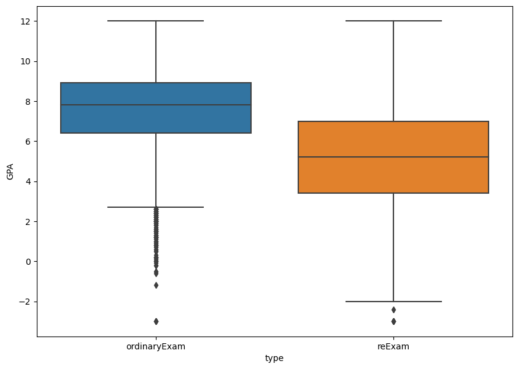

```python
import scraping_class
import time
import re
from bs4 import BeautifulSoup
import pandas as pd
import csv
import json
import pyprind
import urllib.parse
```


```python
import pandas as pd
df = pd.read_csv('KUstatsMerged.csv')
# Convert the DataFrame to a dictionary
df_statistik = df
```

Extractiong number from string


```python
# Convert 'GPA' and 'numPassed' columns to string type
df_statistik['GPA'] = df_statistik['GPA'].astype(str)
df_statistik['numPassed'] = df_statistik['numPassed'].astype(str)

# Perform the requested operations
df_statistik['GPA'] = df_statistik['GPA'].replace('Intet eksamensgennemsnit', None)
df_statistik['GPA'] = df_statistik['GPA'].str.replace(',', '.', regex=True).str.split().str[0]
df_statistik['numPassed'] = df_statistik['numPassed'].str.split().str[0]

```

Converting to numeric variables


```python
# As 'credit' is already of numeric type, we don't need to replace ',' with '.' and convert it to numeric
# We will convert the rest of the columns to numeric type

df_statistik['numSignedUp'] = pd.to_numeric(df_statistik['numSignedUp'], errors='coerce')
df_statistik['numAttended'] = pd.to_numeric(df_statistik['numAttended'], errors='coerce')
df_statistik['numPassed'] = pd.to_numeric(df_statistik['numPassed'], errors='coerce')
df_statistik['GPA'] = pd.to_numeric(df_statistik['GPA'], errors='coerce')

# Converting grading scale columns to numeric
df_statistik['12(B)'] = pd.to_numeric(df_statistik['12(B)'], errors='coerce')
df_statistik['10(I)'] = pd.to_numeric(df_statistik['10(I)'], errors='coerce')
df_statistik['7(U)'] = pd.to_numeric(df_statistik['7(U)'], errors='coerce')
df_statistik['4'] = pd.to_numeric(df_statistik['4'], errors='coerce')
df_statistik['02'] = pd.to_numeric(df_statistik['02'], errors='coerce')
df_statistik['00'] = pd.to_numeric(df_statistik['00'], errors='coerce')
df_statistik['-3'] = pd.to_numeric(df_statistik['-3'], errors='coerce')
df_statistik['Absent'] = pd.to_numeric(df_statistik['Absent'], errors='coerce')

df_statistik.dtypes
```


    Unnamed: 0                                                                    int64
    courseID                                                                     object
    courseName                                                                   object
    faculty                                                                      object
    department                                                                   object
    term                                                                         object
    credit                                                                      float64
    type                                                                         object
    numSignedUp                                                                   int64
    numAttended                                                                   int64
    numPassed                                                                   float64
    GPA                                                                         float64
    12(B)                                                                       float64
    10(I)                                                                       float64
    7(U)                                                                        float64
    4                                                                           float64
    02                                                                          float64
    00                                                                          float64
    -3                                                                          float64
    Absent                                                                      float64
    markingScale                                                                 object
    movingAverage                                                               float64
    Course content                                                               object
    Learning outcome                                                             object
    Coordinators                                                                 object
    \r\nCourse is also available as continuing and professional\r\neducation     object
    \r\nKurset udbydes også til efter- og videreuddannelse                       object
    Type of assessment                                                           object
    Language                                                                     object
    Level                                                                        object
    Study board                                                                  object
    Censorship form                                                              object
    Tutoring                                                                    float64
    Lectures                                                                    float64
    Preparation                                                                 float64
    Excursions                                                                  float64
    Guidance                                                                    float64
    Exercises                                                                   float64
    E-Learning                                                                  float64
    Project work                                                                float64
    Field Work                                                                  float64
    Exam Preparation                                                            float64
    Total                                                                       float64
    dtype: object


```python
df_statistik=df_statistik[df_statistik['numAttended']>3] #exams with less than 3 perticipants aren't showing statistics
df_statistik=df_statistik.reset_index(drop=True)
```


```python
df_statistik
```


<div>
<style scoped>
    .dataframe tbody tr th:only-of-type {
        vertical-align: middle;
    }

    .dataframe tbody tr th {
        vertical-align: top;
    }

    .dataframe thead th {
        text-align: right;
    }
</style>
<table border="1" class="dataframe">
  <thead>
    <tr style="text-align: right;">
      <th></th>
      <th>Unnamed: 0</th>
      <th>courseID</th>
      <th>courseName</th>
      <th>faculty</th>
      <th>department</th>
      <th>term</th>
      <th>credit</th>
      <th>type</th>
      <th>numSignedUp</th>
      <th>numAttended</th>
      <th>...</th>
      <th>Lectures</th>
      <th>Preparation</th>
      <th>Excursions</th>
      <th>Guidance</th>
      <th>Exercises</th>
      <th>E-Learning</th>
      <th>Project work</th>
      <th>Field Work</th>
      <th>Exam Preparation</th>
      <th>Total</th>
    </tr>
  </thead>
  <tbody>
    <tr>
      <th>0</th>
      <td>0</td>
      <td>TTEASK031</td>
      <td>The Philosophy of Religion After the Death of God</td>
      <td>Det Teologiske Fakultet</td>
      <td>NaN</td>
      <td>s20</td>
      <td>15.0</td>
      <td>ordinaryExam</td>
      <td>24</td>
      <td>20</td>
      <td>...</td>
      <td>0.0</td>
      <td>122.0</td>
      <td>0.0</td>
      <td>0.0</td>
      <td>28.0</td>
      <td>0.0</td>
      <td>0.0</td>
      <td>0.0</td>
      <td>270.0</td>
      <td>420.0</td>
    </tr>
    <tr>
      <th>1</th>
      <td>1</td>
      <td>TTEASK031</td>
      <td>The Philosophy of Religion After the Death of God</td>
      <td>Det Teologiske Fakultet</td>
      <td>NaN</td>
      <td>v19</td>
      <td>15.0</td>
      <td>ordinaryExam</td>
      <td>24</td>
      <td>21</td>
      <td>...</td>
      <td>0.0</td>
      <td>122.0</td>
      <td>0.0</td>
      <td>0.0</td>
      <td>28.0</td>
      <td>0.0</td>
      <td>0.0</td>
      <td>0.0</td>
      <td>270.0</td>
      <td>420.0</td>
    </tr>
    <tr>
      <th>2</th>
      <td>2</td>
      <td>TTEASK031</td>
      <td>The Philosophy of Religion After the Death of God</td>
      <td>Det Teologiske Fakultet</td>
      <td>NaN</td>
      <td>s19</td>
      <td>15.0</td>
      <td>ordinaryExam</td>
      <td>23</td>
      <td>19</td>
      <td>...</td>
      <td>0.0</td>
      <td>122.0</td>
      <td>0.0</td>
      <td>0.0</td>
      <td>28.0</td>
      <td>0.0</td>
      <td>0.0</td>
      <td>0.0</td>
      <td>270.0</td>
      <td>420.0</td>
    </tr>
    <tr>
      <th>3</th>
      <td>3</td>
      <td>TTEASK031</td>
      <td>The Philosophy of Religion After the Death of God</td>
      <td>Det Teologiske Fakultet</td>
      <td>NaN</td>
      <td>v18</td>
      <td>15.0</td>
      <td>ordinaryExam</td>
      <td>15</td>
      <td>14</td>
      <td>...</td>
      <td>0.0</td>
      <td>122.0</td>
      <td>0.0</td>
      <td>0.0</td>
      <td>28.0</td>
      <td>0.0</td>
      <td>0.0</td>
      <td>0.0</td>
      <td>270.0</td>
      <td>420.0</td>
    </tr>
    <tr>
      <th>4</th>
      <td>4</td>
      <td>TTEASK030</td>
      <td>Kierkegaards Authorship: On the Loss and Recov...</td>
      <td>Det Teologiske Fakultet</td>
      <td>NaN</td>
      <td>s20</td>
      <td>15.0</td>
      <td>ordinaryExam</td>
      <td>14</td>
      <td>13</td>
      <td>...</td>
      <td>0.0</td>
      <td>122.0</td>
      <td>0.0</td>
      <td>0.0</td>
      <td>28.0</td>
      <td>0.0</td>
      <td>0.0</td>
      <td>0.0</td>
      <td>270.0</td>
      <td>420.0</td>
    </tr>
    <tr>
      <th>...</th>
      <td>...</td>
      <td>...</td>
      <td>...</td>
      <td>...</td>
      <td>...</td>
      <td>...</td>
      <td>...</td>
      <td>...</td>
      <td>...</td>
      <td>...</td>
      <td>...</td>
      <td>...</td>
      <td>...</td>
      <td>...</td>
      <td>...</td>
      <td>...</td>
      <td>...</td>
      <td>...</td>
      <td>...</td>
      <td>...</td>
      <td>...</td>
    </tr>
    <tr>
      <th>17661</th>
      <td>17661</td>
      <td>AANA17101</td>
      <td>Critical Data Studies</td>
      <td>Det Samfundsvidenskabelige Fakultet</td>
      <td>Institut for antropologi</td>
      <td>s18</td>
      <td>7.5</td>
      <td>ordinaryExam</td>
      <td>43</td>
      <td>35</td>
      <td>...</td>
      <td>0.0</td>
      <td>80.0</td>
      <td>0.0</td>
      <td>0.0</td>
      <td>42.0</td>
      <td>0.0</td>
      <td>0.0</td>
      <td>0.0</td>
      <td>85.0</td>
      <td>207.0</td>
    </tr>
    <tr>
      <th>17662</th>
      <td>17662</td>
      <td>AANA17101</td>
      <td>Critical Data Studies</td>
      <td>Det Samfundsvidenskabelige Fakultet</td>
      <td>Institut for antropologi</td>
      <td>s18</td>
      <td>7.5</td>
      <td>reExam</td>
      <td>8</td>
      <td>5</td>
      <td>...</td>
      <td>0.0</td>
      <td>80.0</td>
      <td>0.0</td>
      <td>0.0</td>
      <td>42.0</td>
      <td>0.0</td>
      <td>0.0</td>
      <td>0.0</td>
      <td>85.0</td>
      <td>207.0</td>
    </tr>
    <tr>
      <th>17663</th>
      <td>17663</td>
      <td>AANA17100</td>
      <td>Markets, Power and Global Cities</td>
      <td>Det Samfundsvidenskabelige Fakultet</td>
      <td>Institut for antropologi</td>
      <td>s18</td>
      <td>7.5</td>
      <td>ordinaryExam</td>
      <td>32</td>
      <td>28</td>
      <td>...</td>
      <td>42.0</td>
      <td>85.0</td>
      <td>0.0</td>
      <td>0.0</td>
      <td>0.0</td>
      <td>0.0</td>
      <td>0.0</td>
      <td>0.0</td>
      <td>80.0</td>
      <td>207.0</td>
    </tr>
    <tr>
      <th>17664</th>
      <td>17664</td>
      <td>AANA17100</td>
      <td>Markets, Power and Global Cities</td>
      <td>Det Samfundsvidenskabelige Fakultet</td>
      <td>Institut for antropologi</td>
      <td>v17</td>
      <td>7.5</td>
      <td>ordinaryExam</td>
      <td>39</td>
      <td>34</td>
      <td>...</td>
      <td>42.0</td>
      <td>85.0</td>
      <td>0.0</td>
      <td>0.0</td>
      <td>0.0</td>
      <td>0.0</td>
      <td>0.0</td>
      <td>0.0</td>
      <td>80.0</td>
      <td>207.0</td>
    </tr>
    <tr>
      <th>17665</th>
      <td>17665</td>
      <td>AANA17100</td>
      <td>Markets, Power and Global Cities</td>
      <td>Det Samfundsvidenskabelige Fakultet</td>
      <td>Institut for antropologi</td>
      <td>v17</td>
      <td>7.5</td>
      <td>reExam</td>
      <td>14</td>
      <td>14</td>
      <td>...</td>
      <td>42.0</td>
      <td>85.0</td>
      <td>0.0</td>
      <td>0.0</td>
      <td>0.0</td>
      <td>0.0</td>
      <td>0.0</td>
      <td>0.0</td>
      <td>80.0</td>
      <td>207.0</td>
    </tr>
  </tbody>
</table>
<p>17666 rows × 41 columns</p>
</div>


# Plots for assignment


```python
df_merged=df_statistik
```


```python
import matplotlib.pyplot as plt
import seaborn as sns 
import numpy as np

import warnings
warnings.filterwarnings('ignore')

WAC = lambda x: np.average(x.fillna(0), weights=df_merged.loc[x.index,'numAttended'])

df_7grading = df_merged[df_merged['markingScale']=='7-point grading scale']
df_passed = df_merged[df_merged['markingScale']=='passed/not passed']
```

### 4.1 Plot of weighted GPA vs. non-weighted GPA


```python
fig, ax = plt.subplots(figsize=(10,5))
counts = df_7grading['numAttended'].values
sns.distplot(df_7grading['GPA'].values ,hist_kws={'weights':counts}, ax=ax)
sns.distplot(df_merged.GPA,ax=ax)
plt.legend(['Weighted GPA', 'Non-weighted GPA'])
ax.set_title("GPA distribution")
plt.show()
```


    

    


```python
fig, ax = plt.subplots(figsize=(10,5))
sns.regplot(y='GPA', x='numAttended', data=df_7grading)
```


    <Axes: xlabel='numAttended', ylabel='GPA'>


    

    


### 4.2 Plot of ordinary exam vs. reexam


```python
df_7grading.groupby(['type']).agg(GPA_WAC=('GPA',WAC), GPA_average=('GPA','mean'))
```


<div>
<style scoped>
    .dataframe tbody tr th:only-of-type {
        vertical-align: middle;
    }

    .dataframe tbody tr th {
        vertical-align: top;
    }

    .dataframe thead th {
        text-align: right;
    }
</style>
<table border="1" class="dataframe">
  <thead>
    <tr style="text-align: right;">
      <th></th>
      <th>GPA_WAC</th>
      <th>GPA_average</th>
    </tr>
    <tr>
      <th>type</th>
      <th></th>
      <th></th>
    </tr>
  </thead>
  <tbody>
    <tr>
      <th>ordinaryExam</th>
      <td>7.250029</td>
      <td>7.782538</td>
    </tr>
    <tr>
      <th>reExam</th>
      <td>4.886623</td>
      <td>5.602764</td>
    </tr>
  </tbody>
</table>
</div>


```python
fig, ax = plt.subplots(figsize=(10,5))

for etype in ['ordinaryExam','reExam']:
    counts = df_7grading['numAttended'][(df_7grading['type']==etype)].values
    x = df_7grading['GPA'][(df_7grading['type']==etype)].values
    sns.distplot(x ,hist_kws={'weights':counts}, ax=ax)

plt.legend(['Ordinary exam', 'Reexam'])
ax.set(xlabel='Grade', ylabel='Density')
ax.set_title("Weighted GPA distribution")
plt.show()
```


    

    


```python
f,ax = plt.subplots(figsize=(10,3))
sns.boxplot(x='GPA',y='type', data=df_7grading, ax=ax)
ax.set(xlabel='Grade', ylabel='')
ax.set_title("Non-weighted GPA distribution")
plt.show()
```


    

    


### 4.3 Development in GPA over time


```python
# Define the WAC function again in this environment
WAC = lambda x: np.average(x.fillna(0), weights=df.loc[x.index, 'numAttended'])

# Copy the DataFrame and create the 'term' column
GPA_time=df_7grading.copy()
GPA_time['term'] = df_7grading['term'].str[1:3] + df_7grading['term'].str[0]
p1 = GPA_time.groupby(['term']).agg(GPA_WAC=('GPA', WAC)).reset_index()
f, ax = plt.subplots(1, 1, figsize=(7, 3))
sns.lineplot(x='term', y='GPA_WAC', data=p1, ax=ax)
```


    <Axes: xlabel='term', ylabel='GPA_WAC'>


    

    


### 4.4 GPA within different faculties


```python
df_7grading.groupby(['faculty']).agg(GPA_WAC=('GPA',WAC), GPA_average=('GPA','mean'))
```


<div>
<style scoped>
    .dataframe tbody tr th:only-of-type {
        vertical-align: middle;
    }

    .dataframe tbody tr th {
        vertical-align: top;
    }

    .dataframe thead th {
        text-align: right;
    }
</style>
<table border="1" class="dataframe">
  <thead>
    <tr style="text-align: right;">
      <th></th>
      <th>GPA_WAC</th>
      <th>GPA_average</th>
    </tr>
    <tr>
      <th>faculty</th>
      <th></th>
      <th></th>
    </tr>
  </thead>
  <tbody>
    <tr>
      <th>Det Humanistiske Fakultet</th>
      <td>7.670607</td>
      <td>7.418295</td>
    </tr>
    <tr>
      <th>Det Juridiske Fakultet</th>
      <td>6.380859</td>
      <td>7.296382</td>
    </tr>
    <tr>
      <th>Det Natur- og Biovidenskabelige Fakultet</th>
      <td>7.159282</td>
      <td>7.336965</td>
    </tr>
    <tr>
      <th>Det Samfundsvidenskabelige Fakultet</th>
      <td>7.451475</td>
      <td>7.412260</td>
    </tr>
    <tr>
      <th>Det Sundhedsvidenskabelige Fakultet</th>
      <td>6.936787</td>
      <td>6.999386</td>
    </tr>
    <tr>
      <th>Det Teologiske Fakultet</th>
      <td>6.962972</td>
      <td>6.759777</td>
    </tr>
  </tbody>
</table>
</div>


```python
f,ax = plt.subplots(1,1, figsize=(10,5))
sns.boxplot(y='faculty', x='GPA', data=df_7grading, ax=ax)
plt.xticks(rotation=30)
ax.set_title("Non-weighted GPA distribution")
ax.set(xlabel='Grade', ylabel='')
plt.savefig('3.4.png')
plt.show()
```


    

    


### 4.5 Plotting passed/not passed


```python
# Create a plot
f, ax = plt.subplots(figsize=(10, 5))
sns.boxplot(x=df_passed['numPassed'].values / df_passed['numAttended'].values, 
            y=df_passed['faculty'].values, 
            ax=ax)
ax.set(xlabel='Percentage of passed/attended', ylabel='')
plt.show()

df_passed.groupby(['faculty'])['courseID'].nunique()

# Show the plot
plt.show()

# Print the unique courseID per faculty
df_passed.groupby(['faculty'])['courseID'].nunique()
```


    

    


    faculty
    Det Humanistiske Fakultet                   115
    Det Juridiske Fakultet                        2
    Det Natur- og Biovidenskabelige Fakultet    101
    Det Samfundsvidenskabelige Fakultet         110
    Det Sundhedsvidenskabelige Fakultet         221
    Det Teologiske Fakultet                      34
    Name: courseID, dtype: int64


### 4.6 Course hours against GPA


```python
f,ax = plt.subplots(1,1, figsize=(10,5))
sns.regplot(x="Total", y="GPA", data=df_7grading)
```


    <Axes: xlabel='Total', ylabel='GPA'>


    

    


### 4.7 GPA on Study Boards


```python
#Hard coding study board column:
study_board_dict = {'Studienævnet for Teologi':'Study board of Theology', 'The Study Board for Veterinary Medicine and Animal\r\nScience':'Study Board of Veterinary Sciences',
                   'Veterinærstudienævnet':'Study Board of Veterinary Sciences', 'Studienævnet for Veterinærmedicin og Husdyrvidenskab':'Study Board of Veterinary Sciences',
                   'Study Board for the Master’s Degree in Health Science':'The Study Board for Medicine and Health Science','Studienævnet for Medicin og den Sundhedsfaglige\r\nKandidatuddannelse':'The Study Board for Medicine and Health Science',
                   'Studienævn for den Sundhedsfaglige Kandidatuddannelse':'The Study Board for Medicine and Health Science','Studienævn for den Sundhedsfaglige supplerings- og\r\nkandidatuddannelse':'The Study Board for Medicine and Health Science',
                   'Study Board for the Professionel Master´s Degree Programmes at\r\nThe Faculty og Health and Medical Science': 'The Study Board for Medicine and Health Science',
                   'Studienævnet for Masteruddannelserne ved Det\r\nSundhedsvidenskabelige Fakultet': np.nan, 
                   'Studienævn fra DTU':'Study board for DTU Elektro','Studienævn for DTU Elektro':'Study board for DTU Elektro','DTU Elektro':'Study board for DTU Elektro',
                   'Studienævn for det Biologiske Område': 'Study Board for the Biological Area',
                   'Study board of Medicine':'The Study Board for Medicine and Health Science','Studienævnet for Medicin':'The Study Board for Medicine and Health Science',
                   'Studienævn for Sundhed og informatik': 'Study Board of Health Informatics', 'Studienævn for Biologi og Husdyrvidenskab':'Study Board of Biology and Animal Science',
                   'Studienævn for Psykologi':'Department of Psychology, Study Council','Studienævnet for Psykologi':'Department of Psychology, Study Council',
                   'Antropologi studienævn':'Department of Anthropology, Study Council','Studienævn for Fysik, Kemi og Nanoscience':'Study Board of Physics, Chemistry and Nanoscience',
                   'Studienævnet for Informationsstudier (INF).':'Department of information stuidies','Studienævnet for Informationsstudier (INF)':'Department of information stuidies',
                   'Royal School of Library and Information Science':'Department of information stuidies','Det Informationsvidenskabelige Akademi':'Department of information stuidies',
                   'Study Board of Natural Resources, Environment and Animal\r\nScience': 'Studienævn for Naturressourcer, Miljø og Husdyr',
                   'Studienævn for Fødevarer, Human ernæring og Idræt': 'Study Board of Food, Human Nutrition and Sports',
                   'Professional Bachelor SCIENCE':'Study Board for Professional Bachelor SCIENCE','Professionsbachelorstudienævn SCIENCE':'Study Board for Professional Bachelor SCIENCE',
                   'SCIENCE Professionsbachelor':'Study Board for Professional Bachelor SCIENCE',
                   'Studienævn for Matematik og Datalogi':'Study Board of Mathematics and Computer Science',
                   'Jura': 'Law', 'Studienævnet for Tværkulturelle og Regionale Studier': 'Study Board of Cross-Cultural and Regional Studies',
                   'Studienævnet for Kunst- og Kulturvidenskab':'Study board of Arts and Cultural Studies', 'Studienævn for Biomolekylær videnskab og Teknologi': 'Study Board of Biomolecular Sciences and Technology',
                   'Studienævnet for Folkesundhedsvidenskab og Global\r\nSundhed':'Studienævn for Folkesundhedsvidenskab','The Study Board for Public Health Science and Global\r\nHealth':'Studienævn for Folkesundhedsvidenskab',
                   'Studienævn for Geovidenskaber og Planlægning': 'Study Board of Geosciences and Management', 'Studienævnet for Medier, Erkendelse og Formidling': 'Study Board of Media, Cognition and Communication',
                   'The Study Board for Human Biology and Immunology': 'Study board of Human Biology','Studienævn for de Farmaceutiske Videnskaber':'Study Board of Pharmaceutical Sciences',
                   'Statskundskab studienævn':'Department of Political Science, Study Council',
                   'Studienævn for Naturressourcer og Miljø':'Study Board of Natural Resources and Environment',
                   'Study board from DTU': 'Study board for DTU Elektro', 'Studienævnet for Engelsk, Germansk og Romansk': 'Study board of English, Germanic and Romance Studies',
                   'Study Board for the Professional Master’s Degree Programmes at\r\nThe Faculty of Health and Medical Sciences':'The Study Board for Medicine and Health Science',
                   'Study Board for the Professionel Master´s Degree Programmes at\nThe Faculty og Health and Medical Science': 'The Study Board for Medicine and Health Science',
                   'Study Board of Natural Resources and Environment':'Studienævn for Naturressourcer, Miljø og Husdyr','Studienævn for Folkesundhedsvidenskab':'Study Board for International Health',
                   'Sociologisk studienævn':'Department of Sociology, Study Council', 'Økonomisk Studienævn': 'Department of Economics, Study Council',
                   'Studienævnet for Nordiske Studier og Sprogvidenskab': 'Study Board of Scandinavian Studies and Linguistics','The Staff-Student Committee of the Bachelor/Master of Science\r\nin Public Health':'Study Board for International Health', 
                   }
df_studyBoard = df_7grading.replace({'Study board': study_board_dict})


df_studyBoard = df_studyBoard.groupby(['Study board']).agg(GPA_WAC=('GPA',WAC), GPA_average=('GPA','mean')).reset_index()
df_studyBoard = df_studyBoard.drop(df_studyBoard.index[0])
```

Plot:


```python
# Prepare Data
df_studyBoard = df_studyBoard.sort_values('GPA_WAC')
x = df_studyBoard.loc[:, ['GPA_WAC']]
maks = min(df_studyBoard['GPA_WAC'].tail(5))
mini = max(df_studyBoard['GPA_WAC'].head(5))
df_studyBoard['colors'] = ['red' if x <= mini else 'darkgreen' if x >= maks else 'grey' for x in df_studyBoard['GPA_WAC']]
df_studyBoard = df_studyBoard.sort_values('GPA_WAC')
df_studyBoard.reset_index(inplace=True)

# Draw plot
plt.figure(figsize=(8,14), dpi= 80)
plt.scatter(df_studyBoard.GPA_WAC, df_studyBoard.index, s=450, alpha=.6, color=df_studyBoard.colors)
for x, y, tex in zip(df_studyBoard.GPA_WAC, df_studyBoard.index, df_studyBoard.GPA_WAC):
    t = plt.text(x, y, round(tex, 1), horizontalalignment='center', 
                 verticalalignment='center', fontdict={'color':'white'})

# Decorations
# Lighten borders
plt.gca().spines["top"].set_alpha(.3)
plt.gca().spines["bottom"].set_alpha(.3)
plt.gca().spines["right"].set_alpha(.3)
plt.gca().spines["left"].set_alpha(.3)

plt.yticks(df_studyBoard.index, df_studyBoard['Study board'])
plt.xlabel('Weighted average GPA')
plt.grid(linestyle='--', alpha=0.5)
plt.xlim(4.3, 9)
plt.savefig('studyBoard.png',bbox_inches = 'tight')
plt.show()
```


    

    


### 4.8 GPA and Type of Exam


```python
df_7grading.groupby(['Type of assessment']).agg(GPA_WAC=('GPA',WAC))
```


<div>
<style scoped>
    .dataframe tbody tr th:only-of-type {
        vertical-align: middle;
    }

    .dataframe tbody tr th {
        vertical-align: top;
    }

    .dataframe thead th {
        text-align: right;
    }
</style>
<table border="1" class="dataframe">
  <thead>
    <tr style="text-align: right;">
      <th></th>
      <th>GPA_WAC</th>
    </tr>
    <tr>
      <th>Type of assessment</th>
      <th></th>
    </tr>
  </thead>
  <tbody>
    <tr>
      <th>Portfolio</th>
      <td>8.226577</td>
    </tr>
    <tr>
      <th>continuous assessment</th>
      <td>6.264359</td>
    </tr>
    <tr>
      <th>course participation</th>
      <td>8.338410</td>
    </tr>
    <tr>
      <th>oral examination</th>
      <td>7.997404</td>
    </tr>
    <tr>
      <th>other</th>
      <td>7.349733</td>
    </tr>
    <tr>
      <th>written examination</th>
      <td>6.556516</td>
    </tr>
    <tr>
      <th>written product and oral examination</th>
      <td>8.141686</td>
    </tr>
  </tbody>
</table>
</div>


### 4.9 GPA and Course Level


```python
df_7grading.groupby(['Level']).agg(GPA_WAC=('GPA',WAC))
```


<div>
<style scoped>
    .dataframe tbody tr th:only-of-type {
        vertical-align: middle;
    }

    .dataframe tbody tr th {
        vertical-align: top;
    }

    .dataframe thead th {
        text-align: right;
    }
</style>
<table border="1" class="dataframe">
  <thead>
    <tr style="text-align: right;">
      <th></th>
      <th>GPA_WAC</th>
    </tr>
    <tr>
      <th>Level</th>
      <th></th>
    </tr>
  </thead>
  <tbody>
    <tr>
      <th>Bachelor</th>
      <td>6.593308</td>
    </tr>
    <tr>
      <th>Master</th>
      <td>7.874408</td>
    </tr>
    <tr>
      <th>Propaedeutics</th>
      <td>7.797531</td>
    </tr>
    <tr>
      <th>ph.D.</th>
      <td>7.111604</td>
    </tr>
  </tbody>
</table>
</div>


### 4.10 Type of exam (Percentage of level)


```python
c = df_7grading.groupby(['Level', 'Type of assessment'])['numAttended'].sum().rename("count")
c / c.groupby(level=0).sum()
```


    Level          Type of assessment                  
    Bachelor       Portfolio                               0.014999
                   continuous assessment                   0.027071
                   course participation                    0.026190
                   oral examination                        0.142861
                   other                                   0.061083
                   written examination                     0.678758
                   written product and oral examination    0.049037
    Master         Portfolio                               0.033385
                   continuous assessment                   0.018946
                   course participation                    0.105549
                   oral examination                        0.207933
                   other                                   0.027348
                   written examination                     0.488261
                   written product and oral examination    0.118579
    Propaedeutics  other                                   1.000000
    ph.D.          oral examination                        0.110716
                   written examination                     0.820012
                   written product and oral examination    0.069272
    Name: count, dtype: float64


### 4.11 GPA of course coordinators


```python
def splitCoordinator(df_big):
    df_Coordinator_split = pd.DataFrame()
    error = []

    for row in df_big.itertuples():
        try:
            df_big['Coordinators'][row.Index]
            #List of coordinators:
            res = df_big['Coordinators'][row.Index].strip('][').split(', ') #List of coordinators is being converted from a string to a list.
            for i in range(len(res)): #loops through all elements in list of coordinators
                if(len(res[i].split()) > 2): #Checks if it is a name which appears in the list of coordinators
                    name = res[i].replace("'", "").strip() #extract only coordinator names.
                    df_Coordinator_split = df_Coordinator_split.append(df_big.iloc[row.Index])
                    df_Coordinator_split.iloc[-1, 9] = name #Change the coordinator column to contain one coordinator only
        except: 
            error.append(row.Index)
    try: 
        column_order = ['Extracted course name','Course content','Learning outcome', 'Coordinators', 'Type of assessment', 'Course code', 'Marking scale','Language','Level', 'Study board', 'Censorship form', 'Tutoring', 'Lectures', 'Preparation', 'Excursions', 'Guidance','Exercises', 'E-Learning', 'Project work','Field Work', 'Exam Preparation', 'Total']
        df_Coordinator_split = df_Coordinator_split[column_order]
    except: KeyError
    df_Coordinator_split.to_csv('course_data_coordinatorSplit.csv') 
```

Load dataset splitted on coordinators:


```python
merged_data = pd.read_csv('KUstatsMerged.csv')
splitCoordinator(merged_data)
```

Merge dataset with grade data:


```python
# Convert 'numAttended' to numeric and fill missing values in 'GPA' with 0
df_Coordinator_merged['numAttended'] = pd.to_numeric(df_Coordinator_merged['numAttended'], errors='coerce')
df_Coordinator_merged['GPA'] = df_Coordinator_merged['GPA'].fillna(0)

# Re-calculate GPA and number of students per coordinator
coordinator_GPA = df_Coordinator_merged.groupby(['Coordinators']).agg(
    GPA_WAC=('GPA', WAC_coordinator), 
    GPA_average=('GPA', 'mean'), 
    students=('numAttended', 'sum')).reset_index()

# Print results
num_coordinators = len(coordinator_GPA['Coordinators'].unique())
david_lassen = coordinator_GPA[coordinator_GPA['Coordinators'] == 'David Dreyer Lassen']
andreas_bjerre = coordinator_GPA[coordinator_GPA['Coordinators'] == 'Andreas Bjerre-Nielsen']

num_coordinators, david_lassen, andreas_bjerre
```


    ---------------------------------------------------------------------------

    NameError                                 Traceback (most recent call last)

    ~\AppData\Local\Temp\ipykernel_27684\2646643238.py in <module>
          1 # Convert 'numAttended' to numeric and fill missing values in 'GPA' with 0
    ----> 2 df_Coordinator_merged['numAttended'] = pd.to_numeric(df_Coordinator_merged['numAttended'], errors='coerce')
          3 df_Coordinator_merged['GPA'] = df_Coordinator_merged['GPA'].fillna(0)
          4 
          5 # Re-calculate GPA and number of students per coordinator
    

    NameError: name 'df_Coordinator_merged' is not defined


### 4.12 two sample t-test


```python
import scipy.stats as stats
sample1 = list(df_7grading[df_7grading['Level'] == 'Master']['GPA'])
sample2 = list(df_7grading[df_7grading['Level'] == 'Bachelor']['GPA'])
t_stat, p_val = stats.ttest_ind(sample1, sample2, equal_var=False)
p_val
```


    6.993835016198831e-203


# Plotting the data


```python
import matplotlib.pyplot as plt
import seaborn as sns 
```


```python
f,ax = plt.subplots(1,1, figsize=(10,7))
sns.boxplot(x='type', y='GPA', data=df_statistik, ax=ax)
```


    <Axes: xlabel='type', ylabel='GPA'>


    

    


```python
f,ax = plt.subplots(1,1, figsize=(10,6))
sns.boxplot(x='GPA',y='faculty', data=df_statistik, ax=ax)
```


    <Axes: xlabel='GPA', ylabel='faculty'>


    

    


```python
df_plot = pd.melt(df_statistik, 
                  id_vars=['courseID','courseName','faculty','department','term','credit','type','GPA'], 
                  var_name='name', 
                  value_name='number')
p1 = df_plot[df_plot['name'].isin(['Absent','-3','00','02','4','7(U)', '10(I)', '12(B)'])==True]
sns.catplot(x='name', y='number', col='faculty', data=p1, kind='bar', height=6)

```


    <seaborn.axisgrid.FacetGrid at 0x2421b3f8be0>


    

    


```python
# sns.kdeplot(df_plot['gennemsnit'])
# Create a figure and axis
f, ax = plt.subplots(figsize=(15,10))

# Group the DataFrame by 'faculty' and 'GPA'
gr = df.groupby('faculty').GPA

# For each group, create a KDE plot
for label, arr in gr:
    sns.kdeplot(arr, label=label, fill=False, ax=ax)
    
    # Show the legend
plt.legend()
```


    <matplotlib.legend.Legend at 0x2421d760250>


    

    


```python

```
